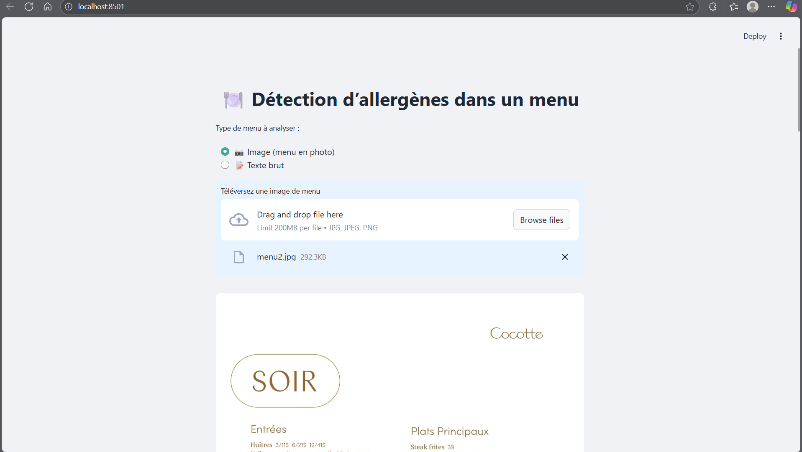
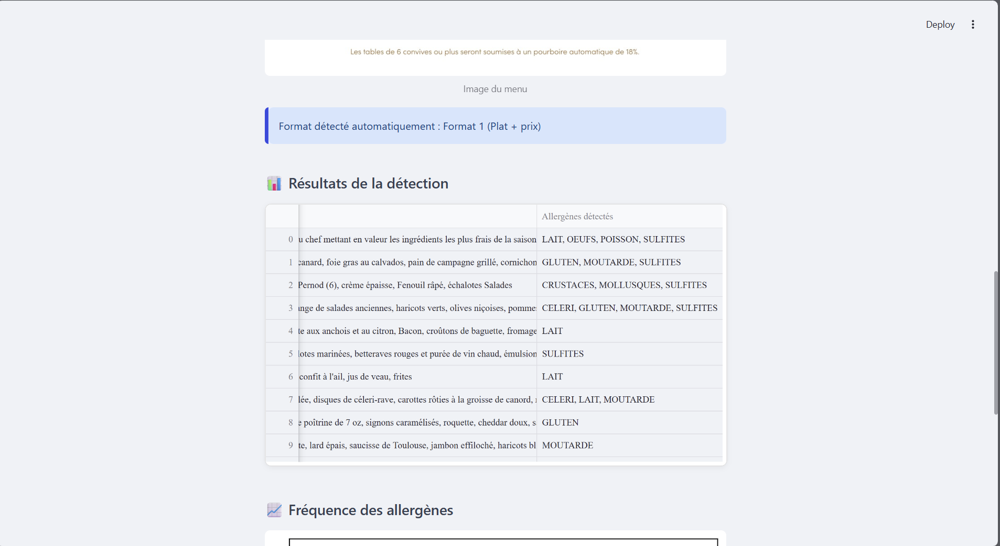
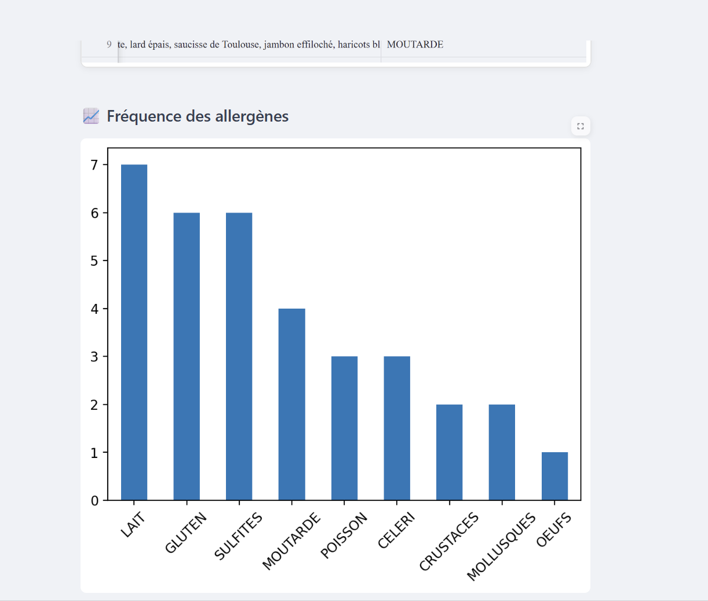

<!-- Bannière -->
## 📸 Aperçu de l’application

<p align="center">
  
  
  
</p>


<h1 align="center">🍽️ Allergen Detector</h1>
<p align="center">
  <b>Détection intelligente des allergènes dans les menus à l’aide de l’intelligence artificielle</b><br>
  <i>Projet réalisé avec Streamlit, spaCy et Python</i>
</p>

---

## 🌟 Aperçu du projet

**Allergen Detector** est une application web qui permet de **détecter automatiquement les allergènes dans les menus de restaurants** à partir d’une **image ou d’un texte brut**.  
Le modèle NLP entraîné avec **spaCy** identifie les ingrédients problématiques et indique les allergènes potentiels.

---

## 🧠 Technologies utilisées

<p align="center">
  
  
  
  
  
</p>

---

## 🚀 Lancer l’application

### 🧩 1. Cloner le dépôt
```bash
git clone https://github.com/faida4/allergen-detector.git
cd allergen-detector
